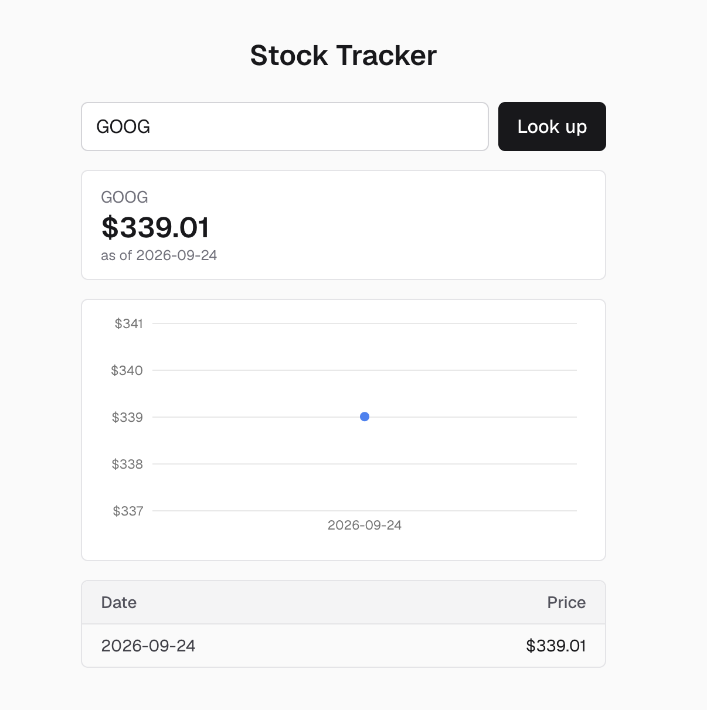

# Stock Tracker

**Live demo:** https://stock-tracker-2.vercel.app/

## The problem

Checking a stock's price usually means opening a finance site cluttered with
news, ads, and analyst opinions you didn't ask for. This app is for anyone
who just wants to type a ticker and see its actual current price and recent
history, with nothing else in the way.

## What it does

Type a stock ticker (e.g. `AAPL`) into the search box and the app:

1. Fetches that stock's real current price from a live market data API
2. Saves the result (ticker, price, date) to a database, so a history builds
   up over time as you use it
3. Shows a price-over-time chart and a table of recent lookups for that
   ticker

It handles the messy real-world cases honestly instead of faking data:
invalid tickers get a clear "not found" message, a closed market shows the
last real trading day (labeled with its actual date), repeat lookups on the
same day reuse the saved price instead of duplicating it, and a failed API
call says so rather than showing a stale or made-up number.

## Screenshot



## Tech stack

- [Next.js](https://nextjs.org) (App Router, TypeScript)
- [Alpha Vantage](https://www.alphavantage.co/) for live stock price data
- [Supabase](https://supabase.com) (hosted Postgres) for storing price
  history
- [Recharts](https://recharts.org) for the price chart
- Deployed on [Vercel](https://vercel.com)

## Running it locally

1. Clone the repo and install dependencies:

   ```bash
   git clone https://github.com/sachinsbhandari2/stock-tracker.git
   cd stock-tracker
   npm install
   ```

2. Create a Supabase project and run this in its SQL editor to create the
   table this app reads and writes:

   ```sql
   create table snapshots (
     id bigint generated always as identity primary key,
     ticker text not null,
     price numeric not null,
     date date not null,
     created_at timestamptz default now(),
     unique (ticker, date)
   );

   grant select, insert on public.snapshots to service_role;
   ```

3. Create a `.env.local` file in the project root with:

   ```
   ALPHA_VANTAGE_API_KEY=your_alpha_vantage_key
   SUPABASE_URL=your_supabase_project_url
   SUPABASE_SERVICE_ROLE_KEY=your_supabase_service_role_key
   ```

   Get a free Alpha Vantage key at
   [alphavantage.co/support/#api-key](https://www.alphavantage.co/support/#api-key),
   and find your Supabase values under Project Settings → API in your
   Supabase dashboard.

4. Start the dev server:

   ```bash
   npm run dev
   ```

   Open [http://localhost:3000](http://localhost:3000) and look up a
   ticker.
