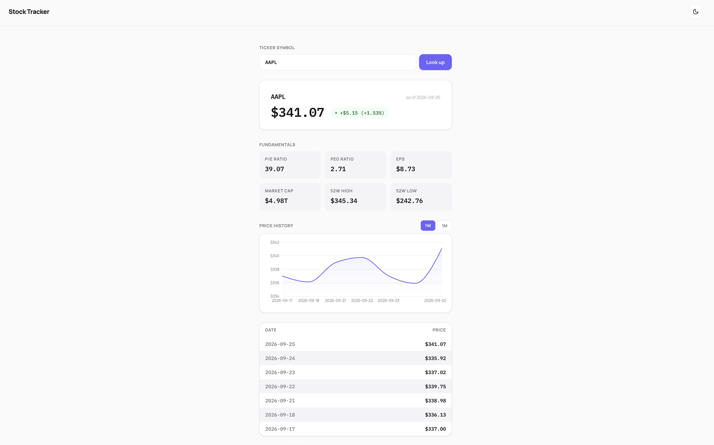

# Stock Tracker

**Live demo:** https://stock-tracker-2.vercel.app/

## The problem

Checking a stock's price usually means opening a finance site cluttered with
news, ads, and analyst opinions you didn't ask for. This app is for anyone
who just wants to type a ticker and see its actual current price and recent
history, with nothing else in the way.

## What it does

Type a stock ticker (e.g. `AAPL`) — autocomplete suggests tickers as you
type — and the app:

1. Fetches that stock's last ~100 trading days of real prices from a live
   market data API — so there's a full chart on your very first lookup, not
   just a single dot
2. Saves each of those days (ticker, price, date) to a database. Existing
   days get refreshed with the latest number instead of duplicated
3. Shows the current price with a color-coded day-over-day change, a
   fundamentals dashboard (P/E ratio, PEG, EPS, market cap, 52-week
   high/low), and a price chart + recent-days table that toggle together
   between a 1-week and 1-month view

It handles the messy real-world cases honestly instead of faking data:
invalid tickers get a clear "not found" message, a closed market shows the
last real trading day (labeled with its actual date), repeat lookups reuse
that day's cached data instead of re-calling the API, a hit rate limit
falls back to whatever's already cached with a clear message instead of a
dead end, and a failed API call says so rather than showing a stale or
made-up number. The whole UI supports a real light/dark toggle (not just
following your OS setting), and no external call is ever made just to
populate a suggestion or a keystroke.

## Screenshot



## Tech stack

- [Next.js](https://nextjs.org) (App Router, TypeScript)
- [Alpha Vantage](https://www.alphavantage.co/) for live stock prices and
  company fundamentals
- [Supabase](https://supabase.com) (hosted Postgres) for storing price
  history, fundamentals, and API-call caching
- [Recharts](https://recharts.org) for the price chart
- [Tailwind CSS](https://tailwindcss.com), with a custom design system
  (color tokens, real light/dark theming)
- Deployed on [Vercel](https://vercel.com)

## Running it locally

1. Clone the repo and install dependencies:

   ```bash
   git clone https://github.com/sachinsbhandari2/stock-tracker.git
   cd stock-tracker
   npm install
   ```

2. Create a Supabase project and run this in its SQL editor to create the
   tables this app reads and writes:

   ```sql
   create table snapshots (
     id bigint generated always as identity primary key,
     ticker text not null,
     price numeric not null,
     date date not null,
     created_at timestamptz default now(),
     unique (ticker, date)
   );

   create table last_checked (
     ticker text primary key,
     checked_on date not null
   );

   create table company_overview (
     ticker text primary key,
     pe_ratio numeric,
     peg_ratio numeric,
     eps numeric,
     market_cap numeric,
     week_52_high numeric,
     week_52_low numeric,
     checked_on date not null
   );

   grant select, insert, update on public.snapshots to service_role;
   grant select, insert, update on public.last_checked to service_role;
   grant select, insert, update on public.company_overview to service_role;
   ```

3. Create a `.env.local` file in the project root with:

   ```
   ALPHA_VANTAGE_API_KEY=your_alpha_vantage_key
   SUPABASE_URL=your_supabase_project_url
   SUPABASE_SERVICE_ROLE_KEY=your_supabase_service_role_key
   ```

   Get a free Alpha Vantage key at
   [alphavantage.co/support/#api-key](https://www.alphavantage.co/support/#api-key),
   and find your Supabase values under Project Settings → API in your
   Supabase dashboard.

4. Start the dev server:

   ```bash
   npm run dev
   ```

   Open [http://localhost:3000](http://localhost:3000) and look up a
   ticker.
